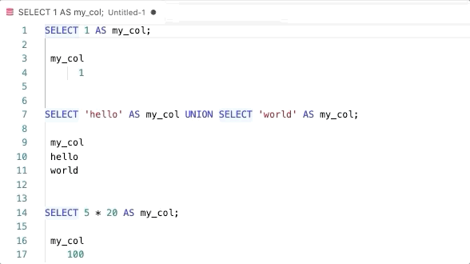

# vscode-sql

This is a plugin to facilitate interactive EDA using SQL.

## Installation

1. Navigate to [Releases](https://github.com/benjamcalvin/vscode-sql/releases)
	and download the latest release.
2. In VSCode, open the command palette (`cmd+shift+p`) and type `Extensions:
	Install from VSIX ...`, or click "Install from VISX" from the extensions sidebar.
3. Select the downloaded `.visx` to install
4. Voila -- reload and it's installed.

## Features

### Running a Query
vscode-sql runs highlighted queries in the background and inserts the results inline. You can do this by hilighting a query (or queries) and using the command palette `Execute SQL command` or pressing `shift+enter`.


### Histograms:

You can insert a histogram instead of a table using `cmd+shift+h` or the `Execute SQL Command (histogram)` command.

```sql
SELECT * FROM(
SELECT 'men', 'age 25-50', 423
UNION
SELECT 'women', 'age 25-50', 102
UNION
SELECT 'men', 'age 50-75', 32
UNION
SELECT 'women', 'age 50-75', 222
) ORDER BY 1,2
;

    men age 25-50 | ############################################################ | 423
    men age 50-75 | #####                                                        | 32
  women age 25-50 | ##############                                               | 102
  women age 50-75 | ###############################                              | 222

```

### Clearing results
You can clear the results of multiple queries after highlighting them using
`cmd+shift+k` or the `VS-SQL: Clear Results` command.



### Find table and columns
 - `cmd+shift+t`: find and insert table name
 - `cmd_shift_c`: find and insert column name
 - (Command palette) `VS-SQL: List All Columns`: list all column names of a
   table, separated by commas

## Database Connections

vcode-sql can manage multiple connections.
However, only one connection can be active at any given time.

### Adding a connection
If you are adding a Bigquery connection, make sure you have logged in using
`gcloud auth application-default login` before proceeding.
  1. Open the command palette and run `VS-SQL: Add Connection`
  2. Enter a connection name (only alphanumrics, dashes, and underscores allowed)
  3. Select a connection type
  4. (Postgres/Redshift only) Enter other connection parameters
  5. Select the newly added connection as the active connection

Note: To edit a connection, add a new connection with the same name to
overwrite it.

### Importing a connection from db-facts
vscode-sql allows importing database credentials from
[db-facts](https://github.com/bluelabsio/db-facts) (recommended for BlueLabs users).
	
  1. Check that the connection exists in db-facts by running
	  `db-facts config <connection-name>` in the terminal
  2. Open the command palette and run `VS-SQL: Import Connection from db-facts`
  3. Enter the db-facts connection name.
  4. (Postgres/Redshift only) Select `Enable SSL` option.
  5. Select the newly added connection as the active connection

### Selecting the active connection
You can change the current active connection by running
`VS-SQL: Select Active Connection` in the command palette or by clicking
on the vs-sql status bar item in the bottom left. This is particularly useful
when working with multiple databases.

### Deleting a connection
Run `VS-SQL: Delete Connection` and select the connection to delete

## Development
1. Navigate into the `vscode-sql` directory.
2. Make sure you've got nodejs installed (and npm).
3. Run `npm install` to install the plugin and development dependencies.
4. Hit `F5` to build the plugin and open a new window for testing.
5. Hit `cmd+shift+F5` to refresh code changes in the debugger window.

### Rebuilding
1. Navigate into the `vscode-sql` directory.
2. Make sure `vsce` is installed:
```bash
npm install -g vsce
```
3. Package the package:
```bash
vsce package --baseImagesUrl https://github.com/benjamcalvin/vscode-sql/blob/main/
```
4. Install the .vslx file that is generated (`vscode-sql-x.x.x.vslx`) using the `Install from VSLX` option or from the terminal using `code --install-extension vscode-sql-X.X.X.vsix`.

For more information, see: https://code.visualstudio.com/api/working-with-extensions/publishing-extension

### Adding support for a new type of database connection
To add support for a new database:
1. Create a new file `<myDb>.ts`
2. This file should contain the following 4 functions with the appropriate return types.
   See `athena.ts` or `postgres.ts` for example.
	- runQueryMyDb
	- listSchemasMyDb
	- listTablesMyDb
	- listColumnsMyDb
3. Add your myDb functions to `db-selection.ts` using if statements
4. Add new database type to `connection.ts`

## Known Issues

### Leaving the Tab
If you leave the tab to go to another tab (you *can* switch to a different window), you'll get this error and the query will fail to insert when it's done.

```
rejected promise not handled within 1 second: Error: TextEditor#edit not possible on closed editors
stack trace: Error: TextEditor#edit not possible on closed editors
	at t.ExtHostTextEditor.edit (/home/ubuntu/.vscode-server/bin/93c2f0fbf16c5a4b10e4d5f89737d9c2c25488a3/out/vs/server/remoteExtensionHostProcess.js:672:475)
	at /home/ubuntu/repos/vscode-sql/out/extension.js:46:24
	at Generator.next (<anonymous>)
	at fulfilled (/home/ubuntu/repos/vscode-sql/out/extension.js:5:58)
	at runMicrotasks (<anonymous>)
	at processTicksAndRejections (internal/process/task_queues.js:94:5)
```

### Histogram Sometimes Fails

```

SELECT 'bob', 2
UNION
SELECT 'tom  ', 3 ;

    bob | ########################################                     | 2
  tom   | ############################################################ | 3


SELECT 'this is a string' as my_string, 1223.4 as value
UNION
SELECT 'this is another string' as my_string, 844.4 as value;

RangeError: Invalid array length
	at histogram (/home/ubuntu/repos/vscode-sql/node_modules/bars/index.js:49:12)
	at Query.format_histogram (/home/ubuntu/repos/vscode-sql/out/query.js:81:25)
	at /home/ubuntu/repos/vscode-sql/out/extension.js:81:88
	at t.ExtHostTextEditor.edit (/home/ubuntu/.vscode-server/bin/93c2f0fbf16c5a4b10e4d5f89737d9c2c25488a3/out/vs/server/remoteExtensionHostProcess.js:672:588)
	at /home/ubuntu/repos/vscode-sql/out/extension.js:80:24
	at Generator.next (<anonymous>)
	at fulfilled (/home/ubuntu/repos/vscode-sql/out/extension.js:5:58)
	at processTicksAndRejections (internal/process/task_queues.js:94:5)

```

### BigQuery findColumn
Using the `findColumn` command (`cmd+shift+c`) actually sends a query to
`INFORMATION_SCHEMA.COLUMNS`. Each execution counts as one query toward your
billing quotas. The size of the query is quite negligible - on the order of a few MBs.

Running `getTables` (`cmd+shift+t`) does not count toward billing quotas.

## Release Notes

### 0.1.6

- Add extended support for Snowflake including list tables/columns.
- Extended fuzzy picker regex to be case-insensitive.

### 0.1.5
Add limited support for Snowflake. Still need to add support for schema commands.

### 0.1.3
Patch SSL Certificate issue #12.

### 0.1.2
Enable SSL Connection.

### 0.1.1
Fix db-facts restart issue. Add caching.

### 0.1.0
Add support for databases
 - Postgres/Redshift
 - Big Query

Add clear results functionality

Add database connection manager
 - Add a new database conneciton (or overwite an existing connection)
 - Remove a database connection
 - Import a connection from db-facts

### 0.0.2

Add metadata functionality:
- `cmd+shift+t` (`Find Table`) to open picker for tables.
- `cmd+shift+c` (`Find Column`) to open picker for columns.
- `List all Columns` command to insert all columns.

### 0.0.1

Minimum functionality. Uses the AWS Athena Javascript SDK to run queries.

**Enjoy!**

### Note to Future Developers:
- Colors is currently pinned because snowflake-sdk was affected by this error in colors: https://github.com/aws/aws-cdk/issues/18322 causing the extension to fail to load. I expect this will be resolved at some point.