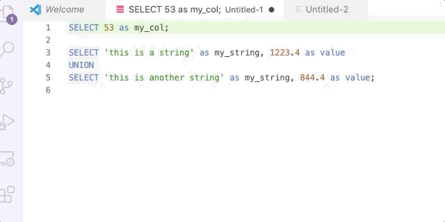

# vscode-sql

This is a plugin to facilitate interactive EDA using SQL.

## Features

### Running a Query
Vscode-sql runs highlighted queries in the background and inserts the results inline. You can do this by hilighting a query (or queries) and using the command pallet `Execute SQL command` or pressing `shift+enter`.



### Histograms:

You can insert a histogram instead of a table using `cmd+shift+h` or the `Execute SQL Command (histogram)` command.

```sql
SELECT * FROM(
SELECT 'men', 'age 25-50', 423
UNION
SELECT 'women', 'age 25-50', 102
UNION
SELECT 'men', 'age 50-75', 32
UNION
SELECT 'women', 'age 50-75', 222
) ORDER BY 1,2
;

    men age 25-50 | ############################################################ | 423
    men age 50-75 | #####                                                        | 32
  women age 25-50 | ##############                                               | 102
  women age 50-75 | ###############################                              | 222

```

## Credentials
Fill out DB credentials in the `db_creds.json` and select one
database as the `default_db`. vscode-sql will use it for all commands.

**DO NOT commit, push to git or share your credentials**

## Installation

1. Navigate to release and download the latest release.
2. In the extensions tab in VSCode, click "Install from VISX"
3. Voila -- reload and it's installed.

### Rebuilding
1. Navigate into the `vscode-sql` directory.
2. Make sure `vsce` is installed:
```bash
npm install -g vsce
```
3. Package the package:
```bash
vsce package --baseImagesUrl https://github.com/benjamcalvin/vscode-sql/blob/main/
```
4. Install the .vslx file that is generated (`vscode-sql-x.x.x.vslx`) using the `Install from VSLX` option.

For more information, see: https://code.visualstudio.com/api/working-with-extensions/publishing-extension

### Development
1. Navigate into the `vscode-sql` directory.
2. Make sure you've got nodejs installed (and npm).
3. Run `npm install` to install the plugin and development dependencies.
4. Hit `F5` to build the plugin and open a new window for testing.
5. Hit `cmd+shift+F5` to refresh code changes in the debugger window.

## Known Issues

### Leaving the Tab
If you leave the tab to go to another tab (you *can* switch to a different window), you'll get this error and the query will fail to insert when it's done.

```
rejected promise not handled within 1 second: Error: TextEditor#edit not possible on closed editors
stack trace: Error: TextEditor#edit not possible on closed editors
	at t.ExtHostTextEditor.edit (/home/ubuntu/.vscode-server/bin/93c2f0fbf16c5a4b10e4d5f89737d9c2c25488a3/out/vs/server/remoteExtensionHostProcess.js:672:475)
	at /home/ubuntu/repos/vscode-sql/out/extension.js:46:24
	at Generator.next (<anonymous>)
	at fulfilled (/home/ubuntu/repos/vscode-sql/out/extension.js:5:58)
	at runMicrotasks (<anonymous>)
	at processTicksAndRejections (internal/process/task_queues.js:94:5)
```

### Histogram Sometimes Fails

```

SELECT 'bob', 2
UNION
SELECT 'tom  ', 3 ;

    bob | ########################################                     | 2
  tom   | ############################################################ | 3


SELECT 'this is a string' as my_string, 1223.4 as value
UNION
SELECT 'this is another string' as my_string, 844.4 as value;

RangeError: Invalid array length
	at histogram (/home/ubuntu/repos/vscode-sql/node_modules/bars/index.js:49:12)
	at Query.format_histogram (/home/ubuntu/repos/vscode-sql/out/query.js:81:25)
	at /home/ubuntu/repos/vscode-sql/out/extension.js:81:88
	at t.ExtHostTextEditor.edit (/home/ubuntu/.vscode-server/bin/93c2f0fbf16c5a4b10e4d5f89737d9c2c25488a3/out/vs/server/remoteExtensionHostProcess.js:672:588)
	at /home/ubuntu/repos/vscode-sql/out/extension.js:80:24
	at Generator.next (<anonymous>)
	at fulfilled (/home/ubuntu/repos/vscode-sql/out/extension.js:5:58)
	at processTicksAndRejections (internal/process/task_queues.js:94:5)

```

## Release Notes

### 0.0.2

Add metadata functionality:
- `cmd+shift+t` (`Find Table`) to open picker for tables.
- `cmd+shift+c` (`Find Column`) to open picker for columns.
- `List all Columns` command to insert all columns.

### 0.0.1

Minimum functionality. Uses the AWS Athena Javascript SDK to run queries.

**Enjoy!**
